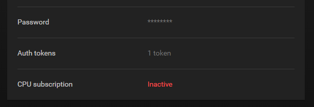
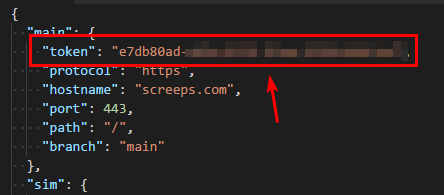

# Authenticating with Screeps

Screeps has recently introduced a [token-based auth system](http://blog.screeps.com/2017/12/auth-tokens/), and the old authentication system will be deprecated by 01 February 2018. The starter kit has been updated to support this new authentication process.

## Migrating to the new auth system

If you have an existing copy of your starter kit, follow these steps:

* Remove the `"username"` and `"password"` keys from your `screeps.json` file, and replace them with `"token"`.
* Upgrade `rollup-plugin-screeps` to version 0.1.1.
* Follow the authentication steps as defined below.

## Seting up Screeps authentication

The authentication token is pulled by the starter kit from a file named `screeps.json`. A sample config file \(`screeps.sample.json`\) is provided within the project, to use it, simply make a copy and rename it to `screeps.json`.

```bash
cp screeps.sample.json screeps.json
```


**IMPORTANT:** The `screeps.json` file contains your Screeps credentials! If you use any source control to store your codebase, **DO NOT** check in this file into your repository.


## Generating an auth token

To generate an authentication token, click **\[your username\] &gt; Manage account**. You should see the **Auth tokens** in the options now, click it.



On the next screen, we'll create a full access token. We pick the **Full access** option, then click the **Generate Token** button.


Your generated token should now be shown on your screen. Copy it to your clipboard.


> **Note:** This token will be displayed **only once**! Make sure to never lose it. However, if you did lose it, simply remove said token from your account, and create a new one.

Now, paste it to your `screeps.json` file.



## Sanity check

Now we'll do a quick check if things are running properly. Let's perform a quick deploy.

```bash
npm run push-main
```

Now go to your Screeps client and check if the `main` branch is created, or if said branch already exists, the code is overwriten to it.

It works? Good, you've successfully authenticated!

Next up, we'll configure our environment and [run our first code deploy](deploying.md).

