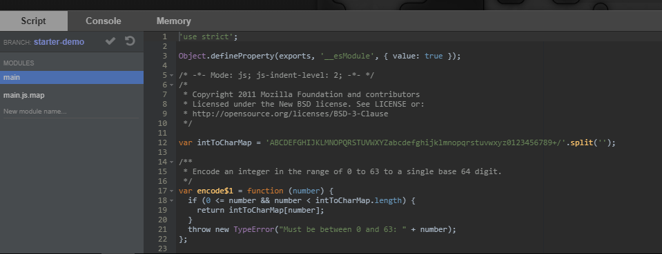

# Deploying

## Building your configuration file

The starter kit builds your code using `rollup`, which uses a `screeps.json` file we built on the previous section as its configuration file.

The `screeps.json` file is a JSON configuration file separated into multiple environments. We're going to focus on the `main` environment to get you started. If you'd like to deploy to a different branch, be sure to change the `branch` key to the branch you'd like to deploy to.


You don't have to manually create the target branch in your Screeps client if it doesn't exist yet. `rollup-plugin-screeps` will do it for you.


## Running your first deploy

Once you're done, run the following command:

```bash
npm run push-main
```

You're done! Now go to your Screeps client and make sure your code is deployed properly.



Ready for something extra? [Read on.](../in-depth/module-bundling.md)

