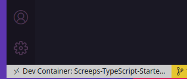

# Remote Development

It may be the case you don't want to install and maintain multiple versions of Node _(10, 12, 14... future releases)_ in your machine, or you don't want to install npm packages globally.

Keep your Screeps-TypeScript project isolated with its dependencies within a container!

VS Code supports remote development and allows you to use a container as a full-featured development environment. You can open a project mounted into a Docker container to edit with full code completions, code navigation, debugging, and more.

Refer to VS Code documentation if you want to understand more about remote development:

- Use a [Docker Container](https://www.docker.com/) as your [development container](https://code.visualstudio.com/docs/remote/containers#_indepth-setting-up-a-folder-to-run-in-a-container)
- Switch your development environment by [connecting to a container](https://code.visualstudio.com/docs/remote/containers)

## Using a Docker Container

Follow these instructions for remote development using a Docker Container.

### Install

To start remote development in dev container, install:

- Docker Desktop. For system requirements and installation instructions, see:
  - [Windows](https://docs.docker.com/docker-for-windows/install/): Currently Docker desktop for windows supports only Linux Containers and [not Windows Containers](https://code.visualstudio.com/docs/remote/containers#_known-limitations). During the install process, ensure you use the default option of Linux Containers.
  - [Mac](https://docs.docker.com/docker-for-mac/install/)
  - [Linux](https://docs.docker.com/engine/install/debian/)
- Latest version of [VS Code](https://code.visualstudio.com/download)
- Latest version of [VS Code Remote Development Extension Pack](https://marketplace.visualstudio.com/items?itemName=ms-vscode-remote.vscode-remote-extensionpack). After you install VS Code and Docker - Desktop for your operating system:
  - For Windows, set source code locations you want to open in a container. In Docker, right-click and select **Settings / Preferences > Shared Drives / File Sharing**. See [Container tips](https://code.visualstudio.com/docs/remote/troubleshooting#_container-tips) if you hit trouble with sharing.
  - For Linux, see [supported platforms](https://docs.docker.com/get-docker/). From the terminal, run `sudo usermod -aG docker $USER` to add your user to the docker group. This setting takes effect after you sign out and back in again.

### Open a Project in a Dev Container

1. Open the project you want to work with or create a new project
2. From the Command Palette, run **Remote-Containers: Reopen in Container**. If you are unable to see this command, make sure that you have installed the latest version of VS Code Remote Development Extension Pack.

VS Code creates a dev container the first time you open the project. After the dev container is built, the project folder in your local system automatically connects and maps to the container, and the side bar shows `Dev Container: Screeps-TypeScript-Starter`.

The container pre-installs and configures all Pre-Requisites for this project + other utils for your daily basis:

- Node 12
- git
- ca-certificates
- openssl
- openssh
